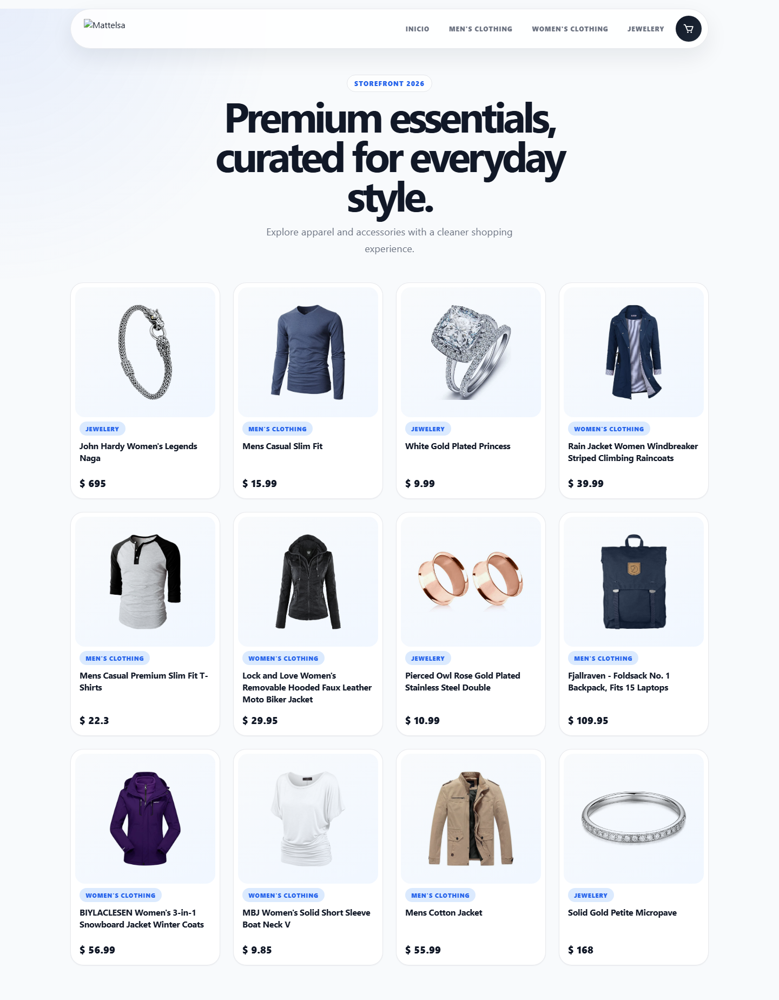
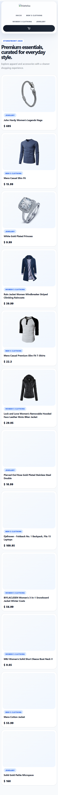
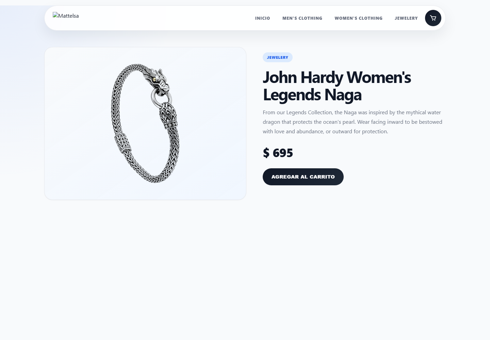
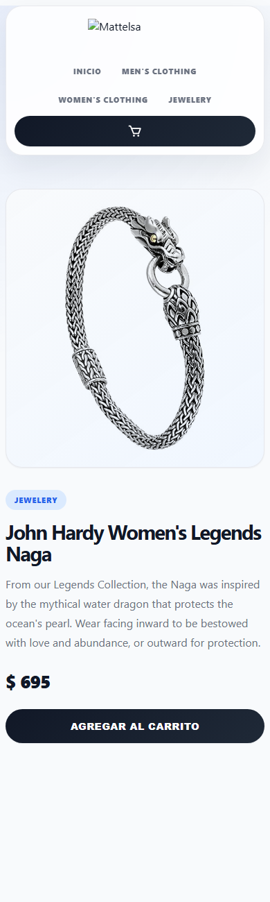
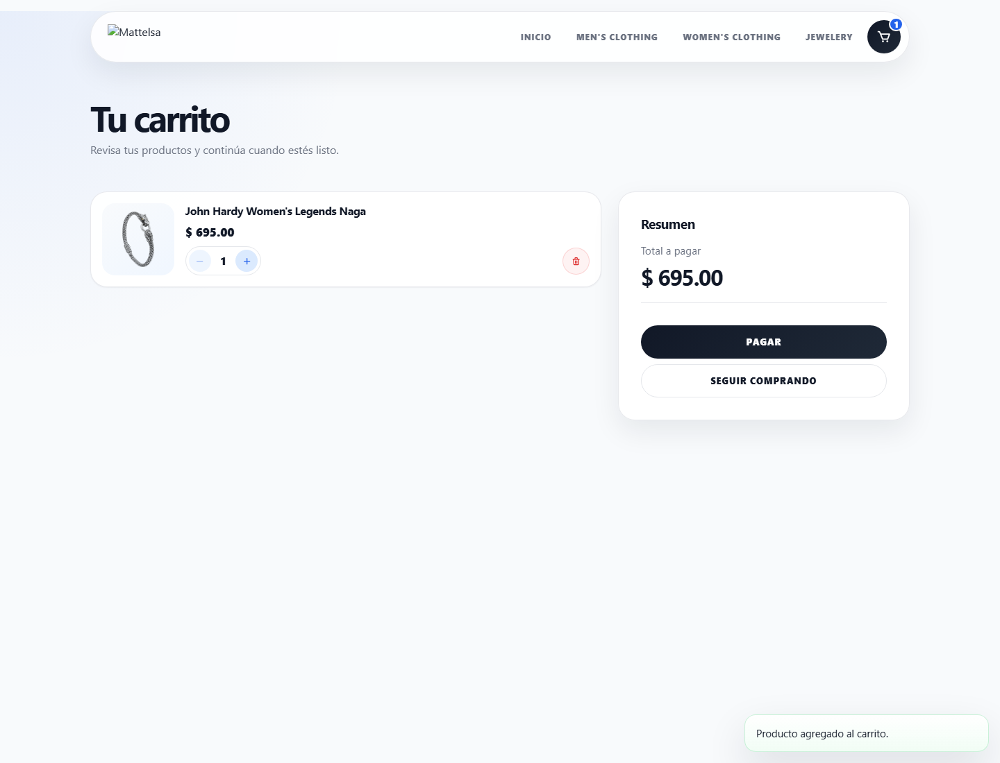
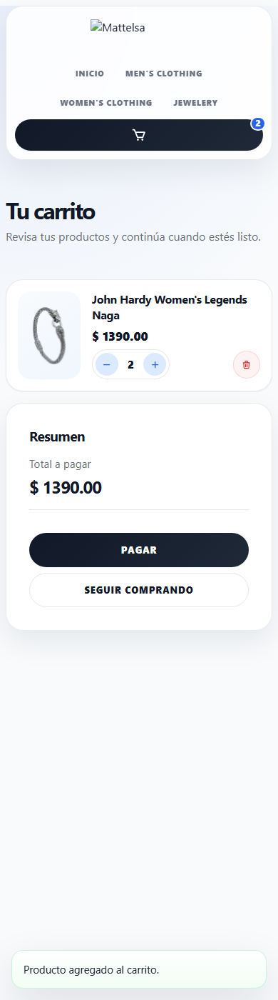
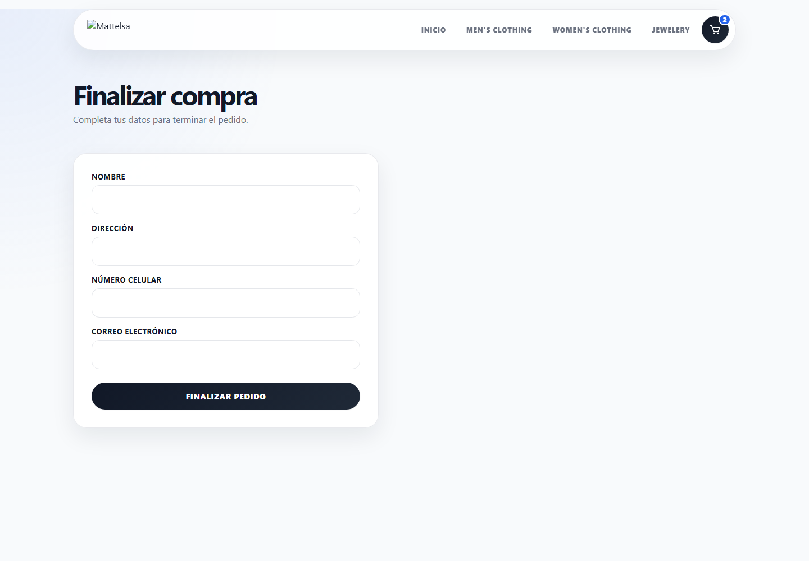
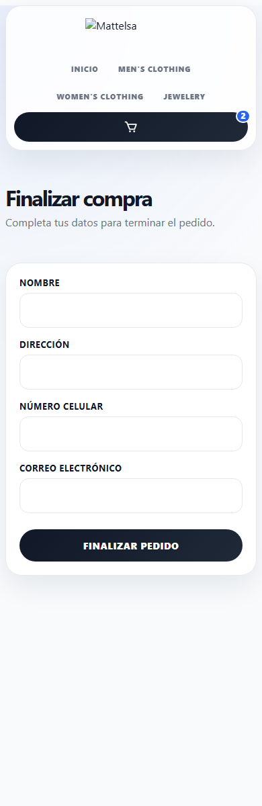
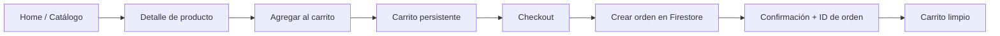

# React Storefront — Ecommerce Demo

Aplicación ecommerce desarrollada con **React** y **Firebase**, diseñada como proyecto de portafolio profesional. Incluye catálogo de productos, carrito persistente, checkout funcional y una experiencia de usuario moderna orientada a conversión.

> Proyecto evolucionado desde una demo académica hasta una storefront funcional, con arquitectura escalable y enfoque en buenas prácticas de frontend.

---

## Descripción

**React Storefront** es una tienda online de demostración que simula un flujo de compra completo: exploración de productos, detalle, carrito y checkout. Los datos se obtienen desde **Cloud Firestore**, lo que permite demostrar integración con backend serverless en un entorno real.

El proyecto fue refactorizado y modernizado en fases progresivas, priorizando:

- Arquitectura mantenible
- UX profesional (loading, empty y error states)
- Funcionalidad end-to-end verificable
- Diseño responsive apto para portafolio 2026

---

## Tecnologías

| Categoría | Stack |
|---|---|
| **Frontend** | React 18, Vite 4 |
| **Routing** | React Router DOM 6 |
| **Estado** | Context API + custom hooks |
| **Backend** | Firebase 9 / Cloud Firestore |
| **Estilos** | CSS, CSS Modules, Sass, design tokens |
| **UI** | Componentes propios + React Icons |
| **Persistencia local** | localStorage |

---

## Arquitectura

La aplicación sigue una estructura por capas, separando responsabilidades de UI, estado, servicios y utilidades:

```text
src/
├── pages/           # Vistas por ruta (Home, Cart, Checkout, ProductDetail)
├── components/      # UI reutilizable (layout, cart, products, ui)
├── context/         # CartContext, ToastContext
├── hooks/           # useCart, useToast
├── services/        # firebase, products, orders
├── utils/           # Lógica de carrito (normalización, totales)
└── styles/          # Tokens, layout global y estilos por feature
```

### Principios aplicados

- **Pages vs Components:** las rutas viven en `pages/`, la UI reutilizable en `components/`.
- **Services layer:** Firestore se consume desde `services/`, no directamente en componentes.
- **Custom hooks:** acceso centralizado al carrito y feedback (`useCart`, `useToast`).
- **Design tokens:** variables CSS reutilizables en `styles/variables.css`.

---

## Características

### Catálogo
- Listado de productos desde Firestore
- Filtrado por categoría
- Grid responsive con cards modernas
- Skeleton loading mientras cargan productos
- Empty y error states amigables

### Detalle de producto
- Layout de dos columnas (desktop) y stack (mobile)
- Imagen destacada con contenedor optimizado
- Badge de categoría, precio y CTA
- Feedback visual al agregar al carrito

### Carrito
- Agregar, incrementar, decrementar y eliminar productos
- Totales calculados de forma segura (sin `NaN`)
- Persistencia en `localStorage` tras refresh
- Resumen de compra con acciones claras
- Empty state profesional

### Checkout
- Formulario con validación HTML5
- Creación real de órdenes en Firestore
- Feedback de éxito con **ID de orden**
- Limpieza automática del carrito tras compra exitosa
- Protección contra doble submit

### UX y accesibilidad
- Toasts para acciones clave (agregar, eliminar, checkout)
- Estados de carga en botones críticos
- `aria-live`, labels asociados y `:focus-visible`
- Microcopy corregido y tono profesional

---

## Capturas

### Catálogo (Desktop / Mobile)

| Desktop | Mobile |
|:---:|:---:|
|  |  |

### Detalle de producto

| Desktop | Mobile |
|:---:|:---:|
|  |  |

### Carrito funcional

| Desktop | Mobile |
|:---:|:---:|
|  |  |

### Checkout

| Desktop | Mobile |
|:---:|:---:|
|  |  |

---

## Instalación

### Requisitos

- Node.js 18+
- npm 9+
- Proyecto Firebase con Firestore habilitado

### Pasos

```bash
# 1. Clonar repositorio
git clone https://github.com/andresmesadev/react-storefront.git
cd react-storefront

# 2. Instalar dependencias
npm install

# 3. Configurar Firebase (ver sección Variables de entorno)

# 4. Ejecutar en desarrollo
npm run dev

# 5. Build de producción
npm run build
npm run preview
```

La app estará disponible en `http://localhost:5173`.

---

## Variables de entorno

> **Estado actual:** la configuración de Firebase está definida en `src/services/firebase.js`.  
> **Recomendación de producción:** migrar credenciales a variables de entorno de Vite.

Crear un archivo `.env` en la raíz:

```env
VITE_FIREBASE_API_KEY=tu_api_key
VITE_FIREBASE_AUTH_DOMAIN=tu_proyecto.firebaseapp.com
VITE_FIREBASE_PROJECT_ID=tu_proyecto
VITE_FIREBASE_STORAGE_BUCKET=tu_proyecto.appspot.com
VITE_FIREBASE_MESSAGING_SENDER_ID=tu_sender_id
VITE_FIREBASE_APP_ID=tu_app_id
```

Ejemplo de uso en `firebase.js`:

```javascript
const firebaseConfig = {
  apiKey: import.meta.env.VITE_FIREBASE_API_KEY,
  authDomain: import.meta.env.VITE_FIREBASE_AUTH_DOMAIN,
  projectId: import.meta.env.VITE_FIREBASE_PROJECT_ID,
  storageBucket: import.meta.env.VITE_FIREBASE_STORAGE_BUCKET,
  messagingSenderId: import.meta.env.VITE_FIREBASE_MESSAGING_SENDER_ID,
  appId: import.meta.env.VITE_FIREBASE_APP_ID,
};
```

### Colecciones Firestore requeridas

| Colección | Uso |
|---|---|
| `items` | Catálogo de productos |
| `ordenes` | Órdenes generadas en checkout |

Campos esperados en `items`: `title`, `price`, `description`, `category`, `image`, `quanty` (opcional).

---

## Estructura del proyecto

```text
react-storefront/
├── docs/
│   ├── screenshots/          # Evidencia visual por fases
│   └── before-upgrade/       # Referencia del estado original
├── public/
├── src/
│   ├── App.jsx
│   ├── main.jsx
│   ├── components/
│   │   ├── cart/
│   │   ├── layout/
│   │   ├── products/
│   │   └── ui/
│   ├── context/
│   ├── hooks/
│   ├── pages/
│   │   ├── Home/
│   │   ├── Cart/
│   │   ├── Checkout/
│   │   └── ProductDetail/
│   ├── services/
│   ├── styles/
│   └── utils/
├── index.html
├── package.json
└── vite.config.js
```

---

## Flujo del ecommerce



### Rutas

| Ruta | Descripción |
|---|---|
| `/home` | Catálogo principal |
| `/category/:categoryName` | Productos filtrados |
| `/item/:id` | Detalle de producto |
| `/cart` | Carrito de compras |
| `/formulario` | Checkout |

---

## Decisiones técnicas

### 1. Context API en lugar de Redux
El alcance del estado global es acotado (carrito + toasts). Context + hooks reduce complejidad sin sacrificar claridad.

### 2. Capa `services/` para Firestore
Centraliza acceso a datos y facilita futuras migraciones (React Query, caching, mocks para tests).

### 3. Utilidades de carrito (`utils/cart.js`)
Normaliza cantidades y totales para evitar bugs de `NaN` y mantener reglas de negocio en un solo lugar.

### 4. Persistencia con localStorage
Solución simple y efectiva para demo/portafolio, sin backend adicional para sesión de carrito.

### 5. Componentes UI propios
Evita dependencia fuerte de librerías de UI y mantiene control total del diseño y accesibilidad.

### 6. Normalización de imágenes externas
Las URLs legacy de Fake Store API se reemplazan por un mirror estable en la capa de servicios, evitando imágenes rotas sin modificar Firestore.

---

## Roadmap

### Corto plazo
- [ ] Migrar Firebase config a variables `VITE_*`
- [ ] Agregar ESLint + Prettier
- [ ] Tests con Vitest + React Testing Library
- [ ] Deploy en Vercel/Netlify/Firebase Hosting

### Mediano plazo
- [ ] Migración gradual a TypeScript
- [ ] React Query para cache y revalidación de productos
- [ ] Autenticación de usuario (Firebase Auth)
- [ ] Historial de pedidos por cliente

### Largo plazo
- [ ] Panel admin para gestión de productos
- [ ] Pagos simulados o integración con pasarela
- [ ] Internacionalización (i18n)
- [ ] Optimización avanzada de performance (code splitting por rutas)

---

## Antes vs Después

| Aspecto | Antes | Después |
|---|---|---|
| **Arquitectura** | Carpetas acopladas y legacy duplicadas | Estructura por capas (`pages`, `services`, `hooks`, `ui`) |
| **UI** | Estilos rígidos, layout básico | Design system moderno, responsive mobile-first |
| **Carrito** | Bugs de cantidad (`NaN`), sin persistencia | Cantidades validadas + localStorage |
| **Checkout** | Roto por imports faltantes | Orden real en Firestore + ID visible |
| **UX** | Sin estados de carga/error | Skeletons, empty/error states, toasts |
| **Accesibilidad** | Labels y focus limitados | `aria-live`, focus visible, botones accesibles |
| **Documentación** | README genérico | README profesional orientado a portafolio |

---

## Aprendizajes obtenidos

1. **Un buen frontend no termina en “que se vea bien”.** Estados de carga, error y vacío son parte del producto.
2. **La arquitectura importa antes que agregar features.** Reorganizar primero aceleró todas las fases siguientes.
3. **Los bugs de datos se propagan rápido.** Normalizar `quanty` y `price` desde el origen evitó inconsistencias en toda la UI.
4. **Persistencia local mejora mucho la demo.** El carrito sobrevive al refresh y la experiencia se siente real.
5. **Separar servicios de UI facilita el mantenimiento.** Firestore quedó aislado y testeable.
6. **Refactor por fases reduce riesgo.** Estructura → UI → UX → funcionalidad permitió avanzar sin romper el flujo.
7. **Documentar decisiones técnicas comunica seniority.** Tanto a reclutadores como a clientes potenciales.

---

## Scripts disponibles

| Comando | Descripción |
|---|---|
| `npm run dev` | Servidor de desarrollo Vite |
| `npm run build` | Build de producción |
| `npm run preview` | Preview del build |

---

## Autor

Proyecto desarrollado y evolucionado como storefront demo para portafolio profesional.

**Repositorio:** [github.com/andresmesadev/react-storefront](https://github.com/andresmesadev/react-storefront)

---

## Licencia

Proyecto educativo/demo. Uso libre con fines de portafolio y aprendizaje.
